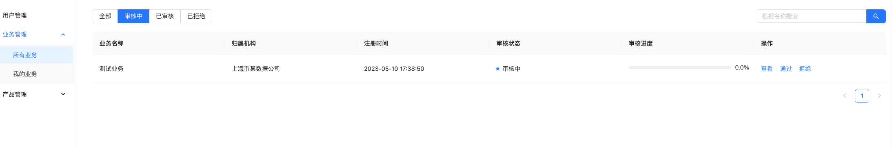
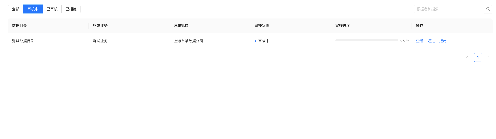

# 快速开始

Data-Brain由三个子项目构成：Data-Brain-Contract、Data-Brain-Server、Data-Brain-Front。
- Data-Brain-Contract：提供项目的智能合约，将会部署在FISCO BCOS上，它包含了数据目录管理、数据传输管理的留痕存证功能。
- Data-Brain-Server：项目的后台服务器，用于支持前端。
- Data-Brain-Front：项目的前端。

## 环境要求
| 依赖软件 | 说明 |备注|
| --- | --- | --- |
| FISCO BCOS | 安装FISCO BCOS 3.0链及控制台/webase | |
| Java |>= JDK[1.8] | 64bit|
| NodeJs |>= 14| |
| MySQL | >= mysql-community-server[5.7] | |
| Git | 下载安装包需要使用Git | |

## 部署项目

作为系统运营方，按照以下顺序进行部署：

- 部署合约：见[部署合约](./docs/DDCMS-Contract/index.md)
- 启动后端：见[启动后端](./docs/DDCMS-Server/index.md)
- 启动前端：见[启动前端](./docs/DDCMS-Front/index.md)

启动后，默认情况下，可以在浏览器看到如下页面：

## 使用流程

为了快速体验流程，用户可以执行如下流程：

### 注册账户

可以使用“注册功能”，以数据提供方身份注册账户：

注意，注册之后，还需要系统运营方进行审核。

### 审核账户
用户需要以系统运营方账户登陆，初始密码取决于后端的[配置]（(./docs/Data-Brain-Server/index.md)）。默认账户和密码为admin、123456。

登陆后，会自动跳转到管理台，用户可以在这里看到对应的待审核账户：

### 创建业务

审核通过后，用户可以提供方机构身份登陆，创建一个新的业务：

### 注册见证机构

用户要再注册两个见证机构，注册页面勾选“见证机构”：

### 审核业务

用户现在可以以见证机构的账户登陆，登陆后自动跳转到管理台，随后可在“所有业务”中看到待申请的业务：

由于审核需要超过半数的见证机构投票，因此在两家见证机构的场景下，投票要两个机构都进行同意，才算审核通过。

### 创建数据目录

类似地，数据提供方可以注册数据目录：

### 审核数据目录

同样，见证机构可以对数据目录进行审核。

由于审核需要超过半数的见证机构投票，因此在两家见证机构的场景下，投票要两个机构都进行同意，才算审核通过。

### 查看

数据产品审核通过后，即可在首页看到：

